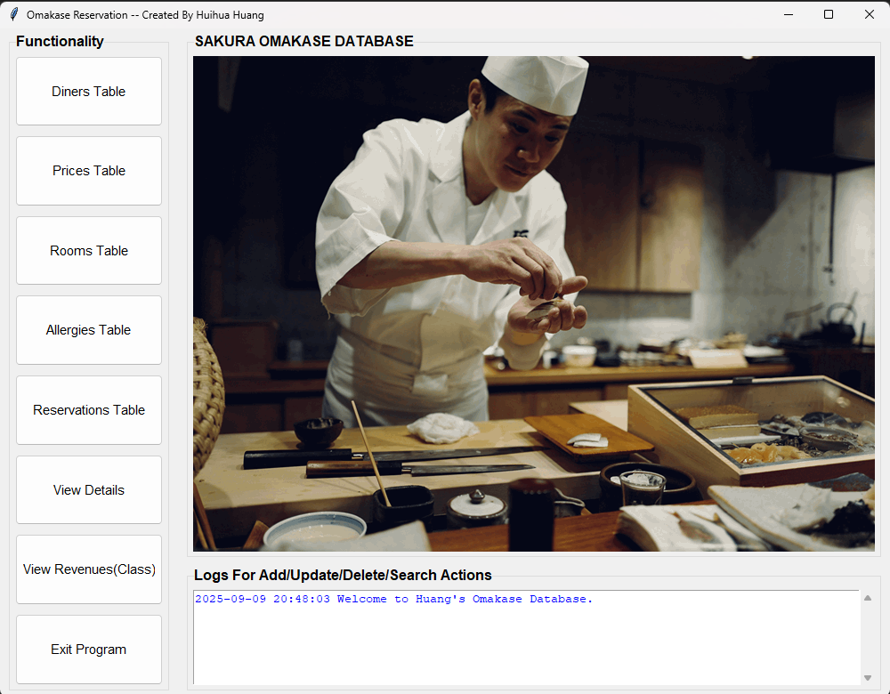
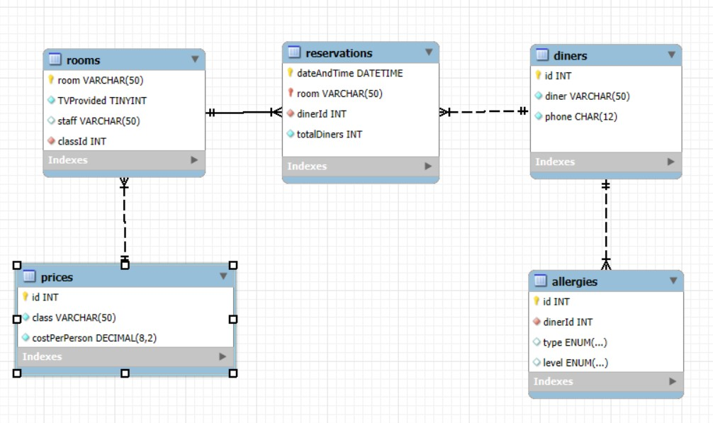
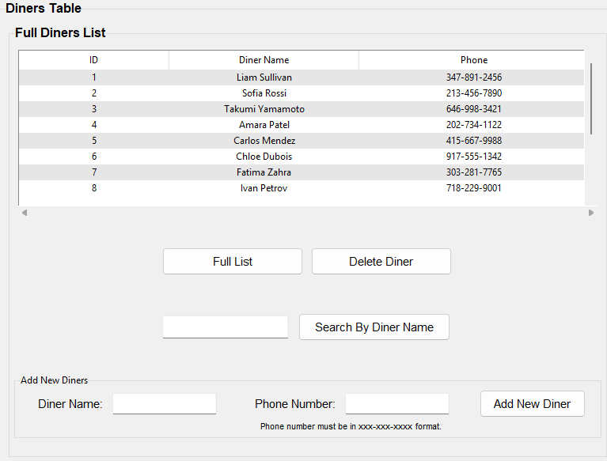
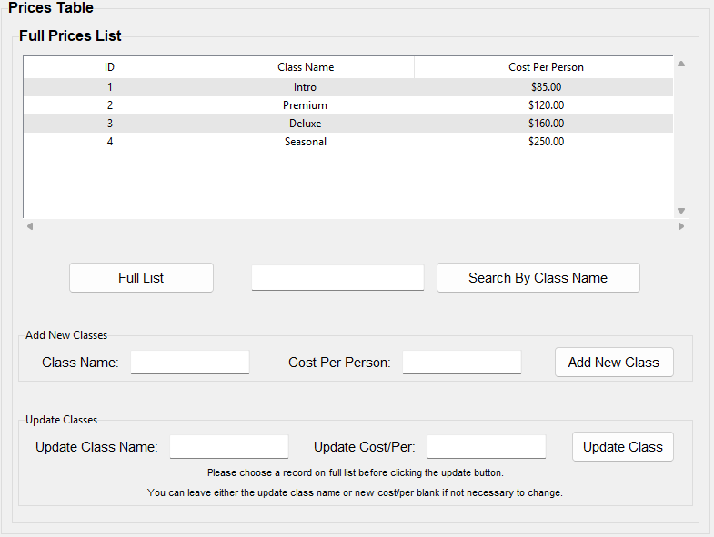
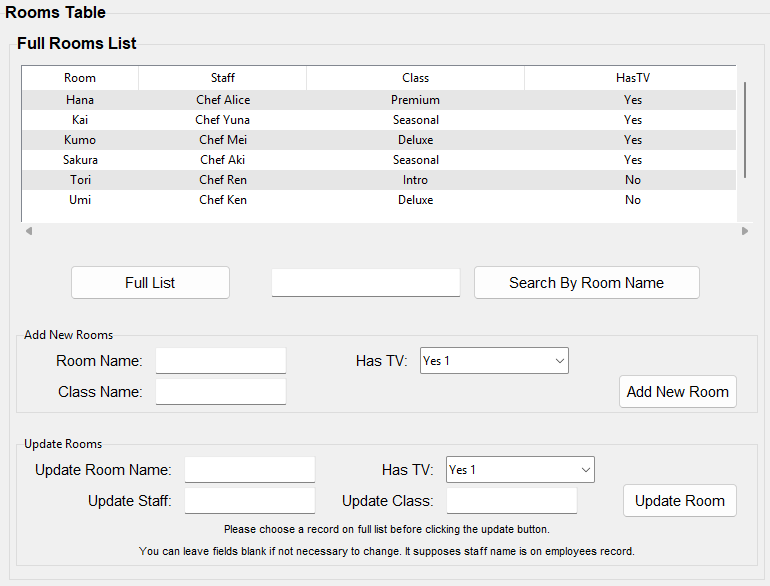
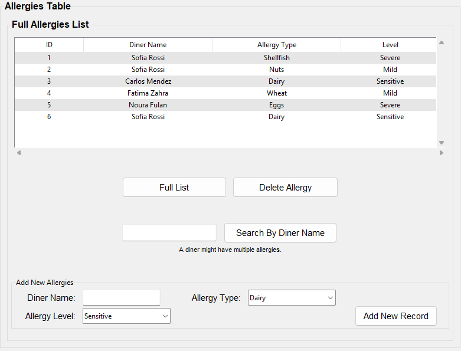
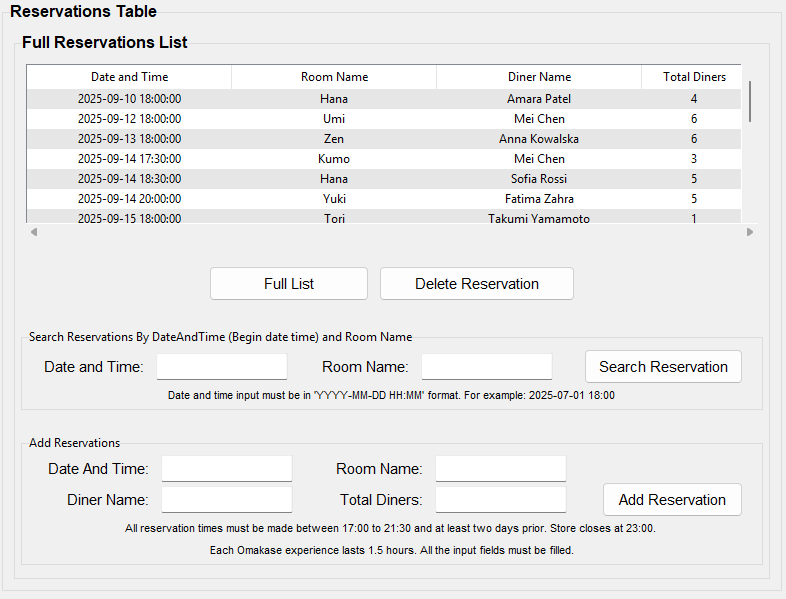
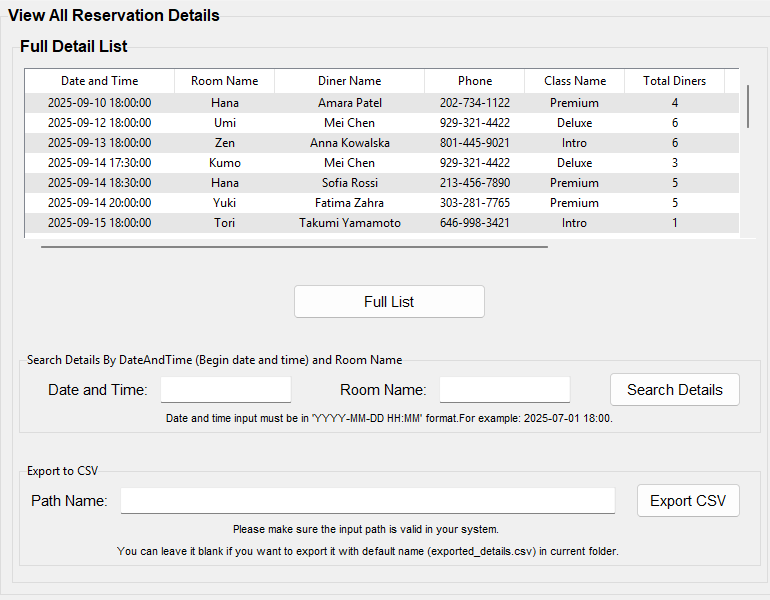
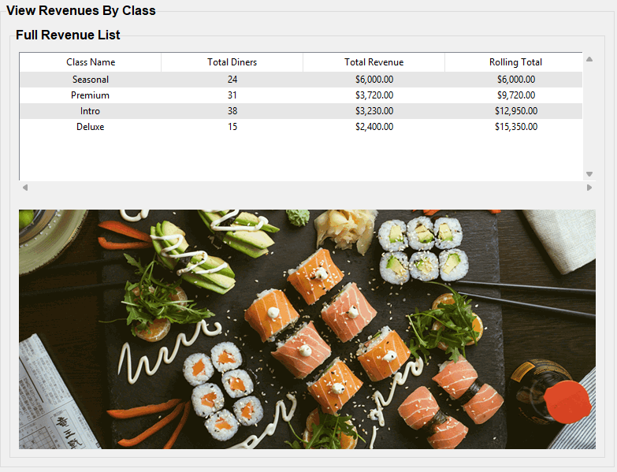

<a id="readme-top"></a>

# Omakase Reservation Application

<details>
  <summary>Table of Contents</summary>
  <ol>
      <li><a href="#about">About</a></li>
      <li><a href="#business-features--rules">Business Features & Rules</a></li>  
      <li><a href="#quick-demo">Quick Demo</a></li>
      <li><a href="#entity-relationship-diagram">ERD</a></li>
      <li><a href="#prerequisites">Prerequisites</a></li>
      <li><a href="#quick-setup-options">Quick Setup Options</a></li>
      <li><a href="#usage">Usage</a></li>
      <li><a href="#project-structure">Project Structure</a></li>
      <li><a href="#license">License</a></li>
      <li><a href="#author"> Author</a></li>
      <li><a href="#references">References</a></li>

  </ol>
</details>

## About

- A full-stack Python **Tkinter + MySQL** application for restaurant reservations.
- It follows a clean architecture with **GUI, BLL(business logic layer), DAL(data access layer)**.
- The system manages diners, prices, rooms, allergies, reservations, details,
  and revenues with advanced features such as **CSV export** and environment-based
  configuration.
- It supports both **local MySQL** and **Dockerized MySQL** setups.
- It was the final project for Database Principles course in my Master’s program,
  selected as an example for next classes by the Professor.
- Originally created in May 2025 and refactored in September 2025 for
  dockerization, cleaner structure and better functionality.

[🔝 back to top](#readme-top)

## Business Features & Rules

- Business Hours: **_17:00 - 23:00_**, seven days a week. All reservation times
  must be made between **_17:00 - 21:30_** since duration of each omakase
  experience is approximately **_1.5_** hours. The system maintains **_non-overlapped_**
  reservations.
- Diners need to reserve room **_at least two days_** prior or the system will
  refuse to make reservations and present failure message.
- The system automatically removes expired reservations every hour. This process
  starts as soon as the database is created. If you use this program in or after
  **_November 2025_**, you may need to update the initial reservation data, since
  the provided seed data ends in October 2025. Otherwise, the system will clear
  out all expired reservations unless new entries are added.
- The advanced feature is **_exporting CSV_**, embedded in the view details
  section since view details is the most important table in the whole setting.
- Each room is an independent dining room, only assigned to one group of diners
  and one chef each time. It is common that each room is locked up a class price
  to serve.
- If a new room is created, owner will be assigned to serve that room by default
  since he has full control of staff scheduling. If he designates the specific
  chef to take care the new room, he can use update function in rooms table.
- Listed allergy types are supposed to cover all diners' situations. The staff
  will contact diners if the specific allergen is not listed.
- It assumes no duplicate names in each table.

[🔝 back to top](#readme-top)

## Quick Demo

**_Click the image to view the [demo video](https://www.loom.com/share/746f1a9201f948f5abdc2c47f16762f5)_**

[](https://www.loom.com/share/746f1a9201f948f5abdc2c47f16762f5)

[🔝 back to top](#readme-top)

## Entity Relationship Diagram

**_The ERD for omakase database_**



[🔝 back to top](#readme-top)

## Prerequisites

1.  Install [Python **3.10+**](https://www.python.org/downloads/)
2.  Install [Git](https://git-scm.com/downloads)
3.  Clone the repo to your local computer

    ```bash
    git clone https://github.com/huihuahuang/omakase-reservation-app.git
    ```

4.  Rename the `omakase-reservation-app` repo into `omakase` for simplicity.
5.  Create a virtual environment:

    ```bash
       # Windows
       python -m venv env

       # Linux/macOS
       python3 -m venv env
    ```

6.  Go to the omakase repo and start the virtual environment.

    ```text
    # cmd
    env\Scripts\activate.bat

    # powershell
    env\Scripts\Activate.ps1

    # Linux/macOS
    source env/bin/activate

    ```

7.  Install package
    ```bash
    pip install -r requirements.txt
    ```

[🔝 back to top](#readme-top)

## Quick Setup Options

### 🔹 Local Run (MySQL Workbench)

1. Install [MySQL Workbench](https://www.python.org/downloads/)
2. Run `ProjectStarter.sql` in MySQL Workbench (creates schema + data).
3. Run the app in the parent of this repo:

   ```bash
   # Windows
   python -m omakase.gui.main

   # Linux/macOS
   python3 -m omakase.gui.main
   ```

4. Change the prefilled information into your local MySQL account information.

   - **For example:**

     

5. Click `Connect`.

---

### 🔹 Docker Run (MySQL image)

**_Use Docker to set up the database. Still run the GUI app locally with Python._**

1. Install [Docker](https://www.docker.com/) and run the **_Docker desktop_**.

2. Go to omakase repo and create a **_.env_** in the same level of the docker
   file as below:

   ```env
   DB_HOST=host.docker.internal
   DB_PORT=3307
   DB_USER=appuser
   DB_PASSWORD=supersecret
   DB_NAME=oma

   ```

3. Start the docker container in the omakase repo:
   ```bash
   docker-compose up -d
   ```
4. Go to the **_parent of the omakase app_** and run the app:

   ```bash
   # Windows
   python -m omakase.gui.main

   # Linux/macOS
   python3 -m omakase.gui.main
   ```

5. The account info will be prefilled. You don't need to change anything.

   - **For example**:

     

6. Click `Connect`.

[🔝 back to top](#readme-top)

## Usage

### Login Screen

- Enter DB credentials (auto-filled from `.env`)
- On success → redirect to dashboard
- On failure → retry with reset defaults

### Dashboard Screen

Three sections:

1. **Functionality (8 buttons)**: Diners, Prices, Rooms, Allergies,
   Reservations, Details, Revenues, Exit
2. **Data Frame**: Add/update/delete/search per table
3. **Action Logs**: Blue = success, Red = error

---

### Advanced Features

- **CSV Export** in Details View
- **Revenue by Class** view (with image background)

---

### Screens

- **Diners Table**

  

- **Prices Table**

  

- **Rooms Table**

  

- **Allergies Table**

  

- **Reservations Table**

  

- **Details Table**

  

- **Revenues Table**

  

[🔝 back to top](#readme-top)

## Project Structure

```text
OMAKASE/
├── bll/ # Business Logic Layer
│ ├── init.py
│ ├── allergies_service.py
│ ├── connection_service.py
│ ├── csv_service.py
│ ├── diners_service.py
│ ├── prices_service.py
│ ├── reservations_service.py
│ ├── rooms_service.py
│ └── views_service.py
│
├── dal/ # Data Access Layer
│ ├── init.py
│ ├── all_details.py
│ ├── allergies.py
│ ├── connection.py
│ ├── create_csv.py
│ ├── diners.py
│ ├── prices.py
│ ├── reservations.py
│ ├── revenue.py
│ └── rooms.py
│
├── db/init/ # Database initialization scripts
| ├── ProjectStarter.sql
│
│
├── gui/ # GUI Layer (Tkinter Frontend)
│ ├── init.py
│ ├── images/ # Background and UI images
| |   |── dash-bg.gif
| |   |── login-bg.gif
| |   |── revenues-bg.gif
│ ├── tables/ # Table-specific UI components
│ │   ├── init.py
│ │   ├── allergies.py
│ │   ├── details.py
│ │   ├── diners.py
│ │   ├── prices.py
│ │   ├── reservations.py
│ │   ├── revenues.py
│ │   └── rooms.py
│ │
│ ├── widgets/ # Reusable GUI Widgets
│ │   ├── init.py
│ │   |── button_entry.py
| |   |── button.py
| |   |── login_entry.py
│ │
│ ├── app.py # Main Application Class
│ ├── config.py # Loads environment variables
│ ├── dashboard.py # Dashboard frame
│ ├── data_display.py # Data display components
│ ├── login.py # Login frame
│ ├── logs.py # Logs panel
│ ├── main.py # GUI entry point for this application
│ └── side_bar.py # Sidebar functionality
│
├── .env # Environment variables
├── .gitignore
├── docker-compose.yml # Docker configuration for MySQL
├── LICENSE
├── demo_images # For readme.md demonstrations
├── README.md
└── requirements.txt # Python dependencies
```

[🔝 back to top](#readme-top)

## LICENSE

This program is licensed under the [MIT License](LICENSE).

[🔝 back to top](#readme-top)

## Author

#### Name: Huihua Huang

#### Email: alicehuang90@yahoo.com

#### Github: https://github.com/huihuahuang

[🔝 back to top](#readme-top)

## References

- Codemy.com [Tkinter Tutorial](https://www.youtube.com/watch?v=yQSEXcf6s2I&list=PLCC34OHNcOtoC6GglhF3ncJ5rLwQrLGnV)
- StackOverflow: [Interval date/time SQL queries](https://stackoverflow.com/questions/33487200/sql-query-by-time-interval)
- LabEx.io: [Exception handling in CSV](https://labex.io/tutorials/python-how-to-catch-and-manage-exceptions-in-python-csv-file-processing-398145)
- ChapGPT: Assisted with documentation writing.

[🔝 back to top](#readme-top)
